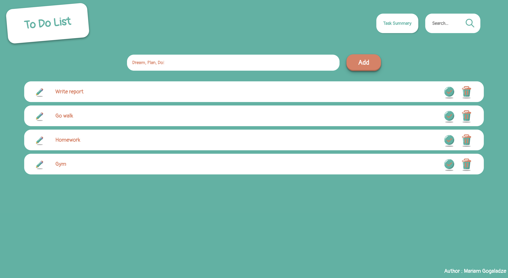
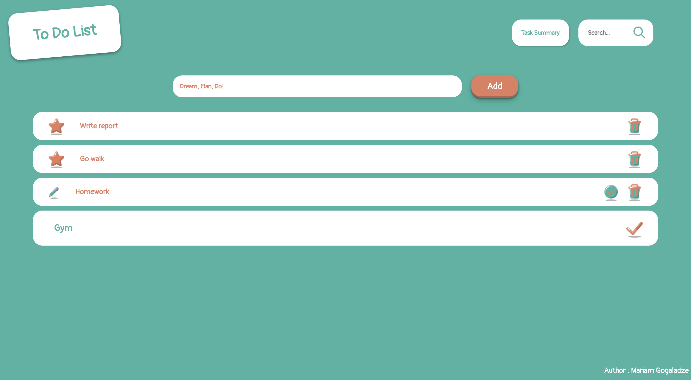
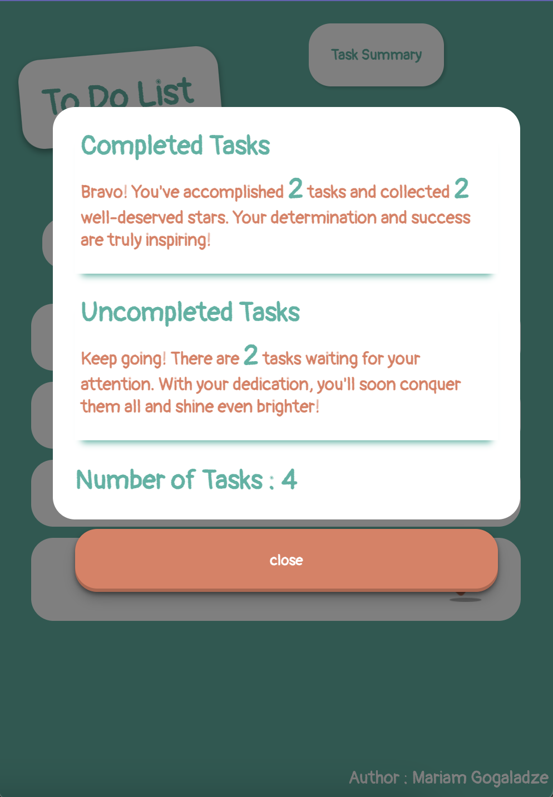

# Welcome! 👋





# ToDo App


## Demo

here : 


## Description

The ToDo App is a simple and intuitive task management application. It allows you to easily keep track of your tasks, mark them as completed, edit task details, and view a summary of your tasks.

## Features

- Add new tasks 
- Mark tasks as completed
- Edit task details
- View a summary of tasks (total tasks, completed tasks, pending tasks)
- Responsive design for optimal viewing on different devices

## Demo

You can try out the live demo of the ToDo App [here](https://your-demo-url.com).

## Installation


1. Clone the repository:

   ```bash
   git clone https://github.com/Mariamgogaladze/Mini-Easy-React-Todoapp

   ```

2. Navigate to the project directory:
   cd react-todoapp
3. Install the dependencies:
   npm install
4. Start the development server:
   npm start
5. Open your browser and visit http://localhost:3000 to see the todoapp app.

## Usage 
- Add a new task by clicking on the "Add Task" button.
- To mark a task as completed, click on the check icon  next to the task.
- Edit a task by clicking on the "Edit" icon (button) and modifying the task details.
- To view a summary of tasks, click on the "Summary" button to see the total number of tasks, completed tasks, and pending tasks.

## Technologies Used

- React
- JavaScript 
- HTML
- CSS

## Dependencies

- react
- react-dom
- react-icons

## Contributing

Contributions are welcome! If you have any suggestions, bug reports, or feature requests, please open an issue or submit a pull request.

## Contact

or any inquiries or questions, feel free to contact [Mariami] at [gogaladzemariam8@gmail.com].